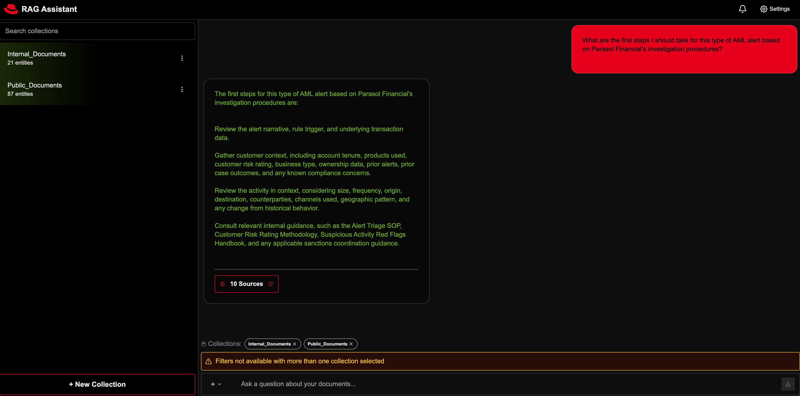
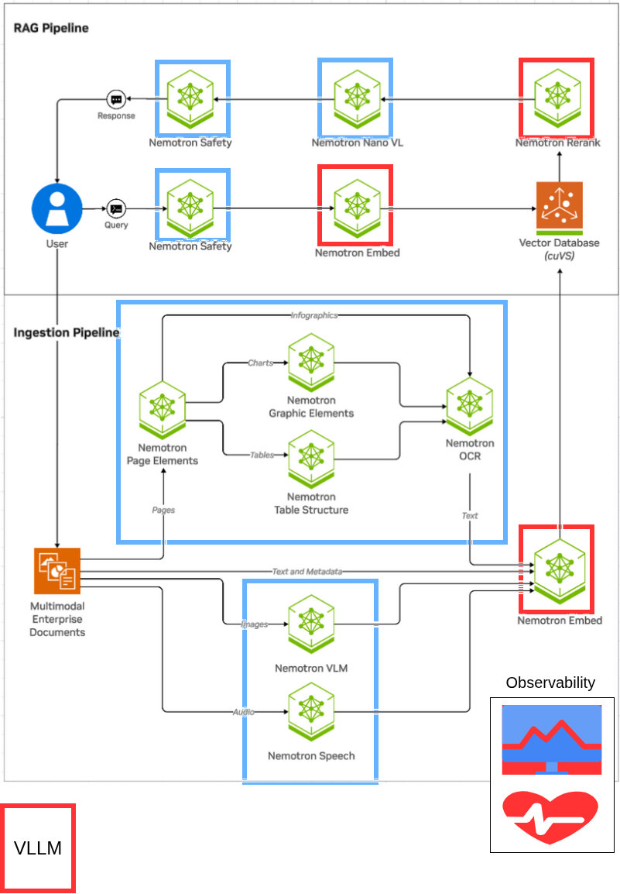
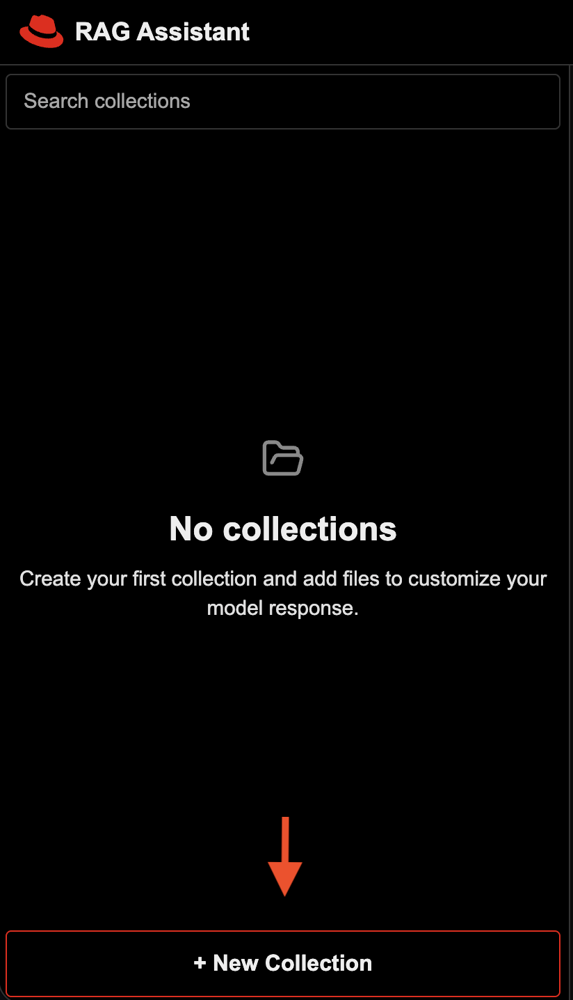
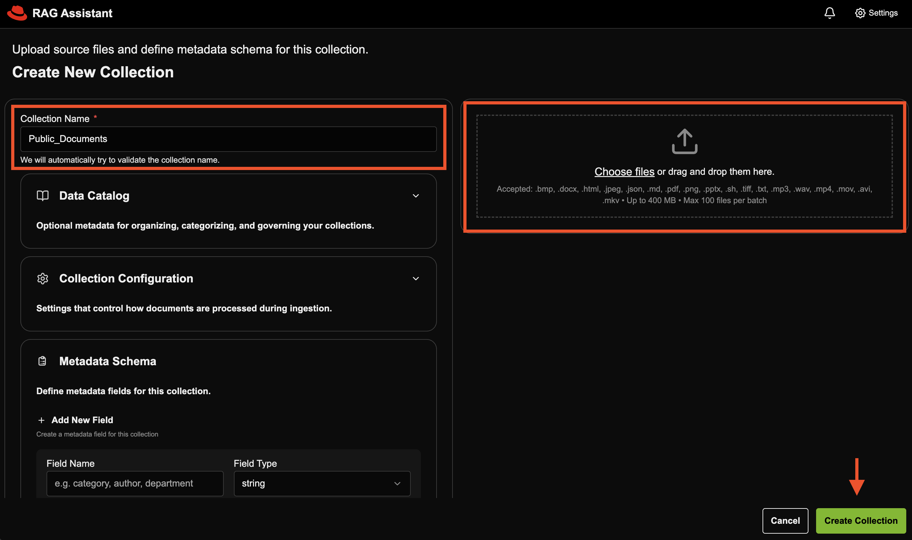

# Streamline AML Investigation Workflows with RAG and NVIDIA

Build anti-money laundering investigation workflows with RAG and NVIDIA models on Red Hat AI, with built-in inference, governance, observability, and more.

## Table of contents

- [Detailed Description](#detailed-description)
  - [See it in Action](#see-it-in-action)
  - [Architecture Diagrams](#architecture-diagrams)
- [Requirements](#requirements)
  - [Minimum Hardware Requirements](#minimum-hardware-requirements)
  - [Minimum Software Requirements](#minimum-software-requirements)
  - [Required User Permissions](#required-user-permissions)
- [Deploy](#deploy)
  - [Prerequisites](#prerequisites)
  - [Install](#install)
  - [Delete](#delete)
- [References](#references)
- [Tags](#tags)

## Detailed description

Anti-money laundering (AML) is the set of processes financial institutions use to detect suspicious activity, investigate potential financial crime, and support regulatory compliance. AML investigations require analysts to move quickly through large volumes of information while still following strict internal procedures and compliance requirements. Investigators often need to pull together context from multiple sources, including case notes, internal policies, sanctions guidance, procedural documentation, and other enterprise records. As a result, even routine investigative tasks can become time-consuming because the work depends on finding and connecting the right information across fragmented systems.

This AI quickstart demonstrates how a Retrieval-Augmented Generation (RAG) application can help accelerate anti-money laundering investigation workflows by grounding AI responses in trusted enterprise content. Rather than generating answers from model knowledge alone, the application retrieves relevant context at query time and uses it to support more informed, document-based responses. This can help analysts more quickly review policies, gather investigation context, summarize relevant materials, and support follow-up work around suspicious activity cases.

Built as a customized version of the NVIDIA RAG blueprint for Red Hat AI, this application shows how AML investigation workflows can run with NVIDIA models on an enterprise-ready AI platform. It highlights how teams can adapt a proven RAG pattern for hybrid cloud environments while aligning with operational needs such as governance, observability, and scalable model serving.

### See it in action 



### Architecture diagrams



This architecture diagram showcases a RAG architecture running on Red Hat AI. The architecture reflects the original NVIDIA RAG blueprint architecture, with select models running with the vLLM ServingRuntime for KServe as indicated by the red square outlines. Red Hat AI adds additional capabilities including built-in observability, governance and more.

## Requirements

### Minimum hardware requirements 

#### GPU Requirements

This deployment uses **FP8 quantized models** for efficient GPU memory usage.

**Models deployed:**
- **Llama-3_3-Nemotron-Super-49B-v1_5-FP8 (LLM)**: ~70GB VRAM
- **NVIDIA-Nemotron-Nano-12B-v2-VL-FP8 (VLM)**: ~35GB total
- **llama-nemotron-embed-1b-v2 (Embedding)**: ~5GB VRAM
- **llama-nemotron-rerank-1b-v2 (Reranking)**: ~5GB VRAM
- **Milvus vector database**: ~5GB VRAM (GPU-accelerated indexing/search)

**Standard deployment (full GPUs):**
- **4-5x NVIDIA H100** (80GB or 94GB) or **A100 80GB**
  - **Option A (Tensor Parallel, recommended)**: 5 GPUs
    - GPU 0-1: LLM tensor parallel across 2 GPUs (higher throughput)
    - GPU 2: VLM
    - GPU 3: Embedding + Reranking
    - GPU 4: Milvus (or share with GPU 3)
  - **Option B (Single GPU LLM)**: 4 GPUs minimum
    - GPU 0: LLM on single H100 94GB (70GB fits with KV cache)
    - GPU 1: VLM
    - GPU 2: Embedding + Reranking
    - GPU 3: Milvus (or share with GPU 2)

**Optional: Multi-Instance GPU (MIG) optimization**

MIG allows you to partition GPUs into smaller slices, enabling multiple models to share a single GPU efficiently. This can reduce GPU requirements from 5 GPUs down to **3 or even 2 GPUs**.

- **With MIG (all-balanced profile)**: 3x H100 GPUs
  - GPU 0: 1x 3g.47gb (LLM rank 0) + 1x 1g.12gb (Embedding)
  - GPU 1: 1x 3g.47gb (LLM rank 1) + 1x 1g.12gb (Reranking)
  - GPU 2: 1x 3g.47gb (VLM) + 1x 1g.12gb (Milvus)

- **With custom MIG profile**: 2x H100 94GB GPUs (minimum)
  - GPU 0: 2x 3g.47gb (LLM tensor parallel)
  - GPU 1: 1x 3g.47gb (VLM) + 3x 1g.12gb (Embedding, Reranking, Milvus)

See [GPU MIG setup instructions](#5-optional-enable-mig-multi-instance-gpu-on-gpu-nodes) for MIG configuration details.

**Note**: This AI quickstart was tested on a single node with 8 NVIDIA H100 94GB NVL GPUs.

#### Storage

- At least **150 GB** of disk space is needed across node(s) for model downloads, container images, and vector data.
  - FP8 models: ~100GB (LLM: 70GB, VLM: 15GB, others: ~15GB)
  - Container images and overhead: ~50GB

### Minimum software requirements

- Red Hat OpenShift Container Platform v4.21
- Red Hat OpenShift AI v3.3
- NVIDIA GPU Operator (tested w/ v25.10.)
- S3-compatible object storage
- Helm CLI: 3.x
- OpenShift Client CLI
- NGC API key
  - With appropriate access to hosted models leveraged in deployment
- HuggingFace token for model weight downloads

### Required user permissions

- cluster-admin or SCC management rights
  - Required to grant the anyuid Security Context Constraint to three service accounts: default, <release>-nv-ingest, and ingestor-server as part of the helm deployment.

## Deploy

The following instructions will easily deploy the quickstart to your Red Hat AI environment using helm charts. 

### Prerequisites

- OpenShift cluster
- OpenShift cluster has GPUs available
- OpenShift AI has a datasciencecluster resource with kserve and dashboard resources, at minimum, set to managed.
- The NVIDIA GPU Operator is installed and configured with a ClusterPolicy to configure the driver.
- OpenShift Data Foundation
  - NooBaa object storage with openshift-storage.noobaa.io StorageClass
  - For advanced storage configuration details see [storage-setup.md](docs/advanced-docs/storage-setup.md)

### Install

1. git clone AI quickstart repository
```
git clone https://github.com/rh-ai-quickstart/aml-rag-nvidia
```

2. cd into the AI quickstart directory
```
cd aml-rag-nvidia
```

3. Ensure you are logged into your OpenShift AI cluster as a cluster-admin user, such as `kube:admin` or `system:admin`:
```
oc whoami
```

4. Set environment variables for secrets:

```
export HF_TOKEN={insert_token}
export NGC_API_KEY=”nvapi-...”
```

5. (Optional) Enable MIG (Multi-Instance GPU) on GPU nodes:

**This step is optional.** MIG allows you to partition GPUs into smaller slices to run multiple models per GPU, reducing GPU requirements from 5 GPUs down to 3 or 2 GPUs. If you skip this step, the deployment will use full GPUs (5 GPUs required).

To enable MIG, label your GPU node to use the balanced MIG configuration:

```bash
# Replace with your actual GPU node name
oc label node <gpu-node-name> nvidia.com/mig.config=all-balanced --overwrite

# Verify label applied
oc get node <gpu-node-name> -L nvidia.com/mig.config

# Wait for MIG Manager to apply configuration (~3-5 minutes)
# Driver pods will restart to enable MIG mode
oc get pods -n nvidia-gpu-operator -w
```

Once all GPU operator pods are Running, verify MIG slices are created:

```bash
# Check available MIG resources
oc describe node <gpu-node-name> | grep nvidia.com/mig
```

6. Deploy all charts (order does not matter, the deployments will resolve)

a. Deploy model-serving chart
```
helm install model-serving ./charts/model-serving --set secret.hf_token=$HF_TOKEN --namespace rag --create-namespace
```

b. Deploy ingest chart
```
helm dependency update ./charts/ingest
helm install ingest ./charts/ingest --set nvidiaApiKey.password=$NGC_API_KEY --namespace rag
```

c. Deploy rag-server chart
```
helm install rag-server ./charts/rag-server --namespace rag
```

d. Deploy frontend
```
helm install frontend ./charts/frontend --namespace rag
```

#### Verify installation

Check all deployed pods are running
```
oc get pods -n rag
```

#### (Optional) Deploy Observability Stack

Deploy the complete observability stack for monitoring, tracing, and visualization:

```bash
cd charts/observability
chmod +x deploy.sh
./deploy.sh
```

This will install:
- Tempo for distributed tracing
- Grafana for metrics visualization
- OpenTelemetry Collector for telemetry collection
- User Workload Monitoring for Prometheus metrics
- Required operators (Cluster Observability, Grafana, OTEL, Tempo)

**Verify observability installation:**

```bash
# Check observability pods
oc get pods -n observability-hub

# Check TempoStack
oc get tempostack -n observability-hub

# Get Grafana URL
oc get route -n observability-hub
```

Default Grafana credentials: `admin` / `admin`

### Using the RAG app

1. Get frontend URL:

```
echo "https://$(kubectl get route -n rag rag-frontend -o jsonpath='{.spec.host}')"
```

2. Navigate to frontend UI in your browser

3. Download AML documents for RAG

Before proceeding with an anti-money laundering investigation or similar workflow, you must obtain the necessary documents. The documents are at the following path:

```
./docs/aml-documents
```

Download these documents locally to prepare for upload into the application.

4. Upload documents to RAG app

Click `New Collection` in the user interface to upload your documents:



Create two separate collections. One collection for the `public-docs` folder, and one collection for the `internal-docs` folder.

**NOTE**: The internal documents provided are fake and AI-generated examples to simulate information that might be used for an anti-money laundering workflow. 

Fill in the required details and click `Create Collection`:



5. Proceed with your anti-money laundering investigation by asking questions in the chat interface.

**Scenario**: You are a financial crimes investigator at the fictional bank `Parasol Financial`, reviewing a transaction monitoring alert on a newly opened small business account that received multiple inbound wires from unrelated entities and moved most of the funds out within 24 hours. You need to gather customer context, review internal AML policy and escalation guidance, identify relevant red flags, and determine whether the activity can be reasonably explained or should be escalated for further review.

**Demo Questions**:

- I’m looking at a newly opened small business account that got several inbound wires from unrelated entities and then moved most of the money out within 24 hours. What red flags should I be focusing on?

- What are the first steps I should take for this type of AML alert based on Parasol Financial’s investigation procedures?

- What customer and account details should I review to figure out whether this activity makes sense for the business?

- Based on Parasol Financial’s escalation guidance, does this case look like it should be escalated for senior review or SAR consideration?

- Can you help me draft a short case summary explaining why this activity is suspicious and what additional review or escalation may be needed?

### Delete

Delete all helm deployments
```
helm uninstall ingest model-serving rag-server frontend -n rag
```

Delete all PVCs in rag namespace
```
oc get pvc -n rag
oc delete pvc --all -n rag
```

(Optional) Delete the entire namespace
```
oc delete namespace rag
```

#### (Optional) Uninstall Observability Stack

If you deployed the observability stack, uninstall it:

```bash
cd charts/observability
chmod +x uninstall.sh
./uninstall.sh
```

Or manually:

```bash
# Uninstall observability components
helm uninstall tracing-ui
helm uninstall grafana -n observability-hub
helm uninstall uwm
helm uninstall otel-collector -n observability-hub
helm uninstall tempo -n observability-hub
helm uninstall tempo-op
helm uninstall otel-op
helm uninstall grafana-op
helm uninstall cluster-obs

# Delete observability namespace
oc delete namespace observability-hub
```

## References 

- [vLLM](https://vllm.ai/): The High-Throughput and Memory-Efficient inference and serving engine for LLMs.
- [NVIDIA Nemotron](https://developer.nvidia.com/nemotron): a family of open models with open weights, training data, and recipes, delivering leading efficiency and accuracy for building specialized AI agents.
- [NVIDIA GPU Operator](https://docs.nvidia.com/datacenter/cloud-native/gpu-operator/latest/index.html): uses the operator framework within Kubernetes to automate the management of all NVIDIA software components needed to provision
  GPU.
- [NVIDIA RAG Blueprint](https://github.com/NVIDIA-AI-Blueprints/rag): The official RAG blueprint from which this AI quickstart is based from.

## Tags

- **Product**: Red Hat AI Enterprise
- **Use case**: Anti-money laundering
- **Industry**: Adopt and scale AI